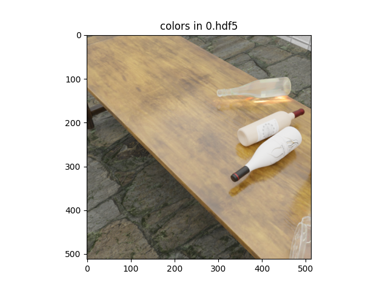

# Data Set Construction for Paper xx

<p align="center">

</p>

## SetUp

As we use [BlenderProc](https://github.com/DLR-RM/BlenderProc) for data set generation, run:

```bash
pip install blenderproc
``` 

You can test your BlenderProc pip installation by running:

```bash
blenderproc quickstart
```


BlenderProc creates the specified scene and renders the image into `output/0.hdf5`.
To visualize that image, simply call:

```bash
blenderproc vis hdf5 output/0.hdf5
```

## Usage

Execute in the main directory:

```bash
blenderproc run main.py
``` 


We used [AmbientCG](https://ambientcg.com/) for wall and floor texture. Please download the textures from cc_textures provided script by blenderproc [here](https://github.com/DLR-RM/BlenderProc/blob/main/blenderproc/scripts/download_cc_textures.py).

Make sure that you have downloaded the `cctextures` before executing.

## Visualization

In the output folder you will find a series of `.hdf5` containers. These can be visualized with the script:

```bash
blenderproc vis hdf5 output/*.hdf5
``` 
